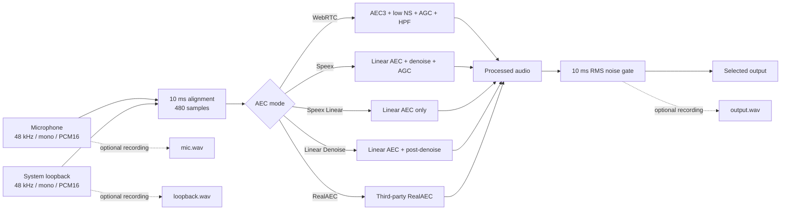

# Real-time Echo Cancellation

[中文](README.md)

A Windows desktop acoustic echo cancellation (AEC) application. It captures microphone and system-loopback streams through WASAPI, processes 48 kHz mono audio in 10 ms frames with a selectable algorithm, and sends the result to a selected output device. The Qt 6 GUI includes device selection, live waveforms, tray controls, startup/state persistence, and segmented three-track recording.

## ⚠️ Install VB-CABLE for virtual microphone output

To use the processed audio from this application as a “microphone” in conferencing, streaming, or voice applications, first install [VB-CABLE Virtual Audio Device](https://vb-audio.com/Cable/). It creates a virtual audio input that acts as the pipe between applications.

1. Select **CABLE Input (VB-Audio Virtual Cable)** as the output device in this application.
2. Select **CABLE Output (VB-Audio Virtual Cable)** as the microphone in the conferencing, streaming, or voice application.

The processed audio is then written to CABLE Input and exposed to other applications as a virtual microphone through CABLE Output.

> The current target is Windows x64 with MinGW. `RealAEC` is a third-party binary SDK bundled with the repository; publishers must verify its licensing and redistribution terms separately.

## Features

- Five modes: WebRTC AEC3, Speex, Speex Linear, Speex Linear + post-denoise, and RealAEC
- Selectable microphone, system-loopback, and output devices with persisted settings
- Start/stop controls, tray status, and live average frame-processing time
- Live microphone, loopback-reference, and processed-output waveforms
- Optional login startup, silent background launch, and previous engine-state restoration
- Configurable background image/opacity and remembered adaptive window size
- Three PCM16 WAV tracks split every 10 minutes under the executable's `record/` directory
- Single-instance protection with a duplicate-launch message

## Audio pipeline



Each algorithm call handles 480 samples: `480 / 48000 = 10 ms`. The per-frame timing below measures the processing function only; device buffers, scheduling, resampling, and sound-card latency are not included, so it is not end-to-end latency.

## Modes

| Value | Processing chain | Trade-off |
|---|---|---|
| `webrtc` | WebRTC AEC3 + low noise suppression + digital AGC + high-pass filter | Strongest echo suppression; may alter level and timbre |
| `speex` | Speex linear AEC + denoise + AGC | Low CPU cost with the complete Speex post-processing chain |
| `speex_linear` | Speex linear AEC only | Least post-processing and usually most natural, with more residual echo/noise |
| `speex_linear_denoise` | Speex linear AEC + post-denoise, AGC off | Compromise between voice preservation and residual-noise removal |
| `real_aec` | Third-party RealAEC SDK | Closed binary mode; compatibility depends on the SDK |

## Usage and configuration

Download the ZIP produced by GitHub Actions or a Release, extract it, and run `SpeexEchoCanceller.exe`. Select the three devices and a mode, then start the engine. Closing the window offers full exit or minimization to the tray; double-click the tray icon to restore it.

`config.ini` is stored next to the executable. When recording is enabled, each segment contains three mono PCM16 WAV files identified by timestamp and track name.

| Key | Type/range | Meaning |
|---|---|---|
| `mic_id` | WASAPI device ID | Microphone capture endpoint |
| `loopback_id` | WASAPI device ID | Render endpoint used for loopback capture |
| `output_id` | WASAPI device ID | Processed-audio playback endpoint |
| `aec_type` | one of the five values above | Processing mode; default: `speex_linear_denoise` |
| `noise_gate_threshold_dbfs` | `-80.0`–`0.0` dBFS | Post-gate 10 ms frame-RMS threshold; the GUI step is 0.1 dB |
| `auto_start` | `0` / `1` | Start silently after Windows login |
| `engine_running` | `0` / `1` | Restore the engine state on next launch |
| `recording_enabled` | `0` / `1` | Record three tracks while the engine runs |
| `background_image` | absolute or relative path | Background image; relative to the EXE directory |
| `background_opacity` | `0.0`–`1.0` | Background-image visibility |
| `window_width` | pixels; `0` means automatic | Remembered window width |
| `window_height` | pixels; `0` means automatic | Remembered window height |

The GUI also accepts `--background` for a tray-only launch. The threshold slider directly uses `-80.0` to `0.0 dBFS` with a 0.1 dB step. A complete 10 ms output frame is zeroed when its RMS is below the threshold. Editing the value automatically restarts a running engine so the new value takes effect. The previous normalized `noise_gate_threshold` setting is converted and migrated automatically when read.

## Build

Requirements: Windows 10/11 x64, CMake 3.20+, Qt 6.8.x for MinGW 64-bit, and the matching MinGW toolchain. SpeexDSP, WebRTC APM, Abseil, and RealAEC are in the source tree. Qt may be installed under `third_party/qt6/`; that downloaded SDK is intentionally ignored by Git.

```powershell
cmake -S . -B build -G "MinGW Makefiles" `
  -DCMAKE_BUILD_TYPE=Release `
  -DCMAKE_PREFIX_PATH=C:/Qt/6.8.3/mingw_64 `
  -DAEC_ENABLE_LOCAL_DEPLOY=OFF
cmake --build build -j
powershell -File scripts/package_release.ps1 `
  -BuildDir build -OutputDir dist `
  -QtBinDir C:/Qt/6.8.3/mingw_64/bin
```

For automatic local deployment after a successful build, set `AEC_ENABLE_LOCAL_DEPLOY=ON` and `AEC_DEPLOY_DIR` (default: `D:/实时回声消除`). `REAL_AEC_CONFIG` selects `Debug` or `Release`; `Debug` is the default because that SDK variant is currently verified in the GUI.

## Performance

Measured on 2026-09-09 on Windows x64, AMD64 Family 25 (12 logical processors), MinGW 13.1, Release optimization. Input was 48 kHz mono PCM16 with 480-sample (10 ms) frames; each open-source mode processed 16,303 frames with a `-40 dBFS` gate threshold. The complete `Process()` call is timed, including the algorithm, RMS calculation, and gate decision. The GUI average also stops timing only after the gate has completed.

| Mode | Mean/frame | P95 | Maximum | Real-time factor | 10 ms budget |
|---|---:|---:|---:|---:|---:|
| WebRTC | 0.1289 ms | 0.2643 ms | 11.5649 ms | 0.0129 | 1.29% |
| Speex | 0.1030 ms | 0.1898 ms | 1.2432 ms | 0.0103 | 1.03% |
| Speex Linear | 0.0696 ms | 0.1224 ms | 0.8816 ms | 0.0070 | 0.70% |
| Speex Linear Denoise | 0.1046 ms | 0.1885 ms | 2.0583 ms | 0.0105 | 1.05% |
| RealAEC | no valid result | — | — | — | — |

The standalone RealAEC benchmark exited abnormally inside `REAL_AEC_create()` before frame processing began. Startup time or an invented estimate is therefore not reported. The GUI-compatible Debug SDK remains available, but the mode needs separate stability and licensing verification before release.

- Frame duration: `samples_per_frame / sample_rate × 1000`
- Mean: `Σ process_time_ms / frame_count`
- P95: 95th percentile of sorted frame times
- Real-time factor: `mean_process_ms / frame_ms`; it must remain below 1
- Frame-budget share: `RTF × 100%`

Build with `AEC_BUILD_BENCHMARK=ON`, then run:

```powershell
build\aec_benchmark.exe mic.wav loopback.wav 7 speex_linear_denoise -40
```

## Echo-reduction measurements

The table uses one approximately 23-second field recording. The best microphone/loopback correlation lag was 1,921 samples (40.021 ms). These are comparative proxy metrics for this sample, not laboratory ERLE. There is no isolated clean near-end track, so near-end speech loss cannot be measured rigorously.

| Mode | Output RMS | Level vs mic | Far-end correlation | Projected echo | Projection reduction |
|---|---:|---:|---:|---:|---:|
| WebRTC | -42.293 dBFS | -4.409 dB | 0.00099 | -102.354 dBFS | 56.471 dB |
| Speex | -32.469 dBFS | +5.415 dB | 0.00628 | -76.509 dBFS | 30.626 dB |
| Speex Linear | -42.721 dBFS | -4.837 dB | 0.01360 | -80.048 dBFS | 34.166 dB |
| Speex Linear Denoise | -43.856 dBFS | -5.972 dB | 0.00362 | -92.675 dBFS | 46.792 dB |
| RealAEC | -41.020 dBFS | -3.136 dB | 0.01015 | -80.891 dBFS | 35.008 dB |

On this sample, WebRTC has the lowest far-end leakage proxy. `speex_linear_denoise` reduces correlated residue further than the linear-only mode, but also has a lower total level. Full Speex raises total level through AGC. Total-level change includes speech, noise, and removed echo and must not be interpreted directly as speech loss.

- RMS dBFS: `20 log10(rms(x))`, after normalizing PCM16 to `[-1, 1]`
- Level vs mic: `20 log10(rms(output) / rms(mic))`
- Far-end correlation: `|corr(output, aligned_loopback)|`; lower means less linearly correlated leakage
- Projected echo: with `a = (output·far)/(far·far)`, report dBFS of `rms(a×far)`
- Projection reduction: mic projected-echo dBFS minus output projected-echo dBFS
- Standard ERLE is commonly `10 log10(E[y²] / E[e²])`; this recording lacks an isolated echo-path signal `y`, so the table deliberately reports a projection proxy instead

Recalculate with Python 3 and NumPy:

```powershell
python scripts/analyze_aec.py --mic mic.wav --loopback loopback.wav `
  aec_webrtc.wav aec_speex.wav aec_speex_linear.wav `
  aec_speex_linear_denoise.wav aec_real_aec.wav
```

## CI and releases

`.github/workflows/build-and-release.yml` builds and uploads a Windows ZIP for pushes and pull requests. A `v*` tag also creates a GitHub Release and attaches the ZIP.

```powershell
git tag v1.0.0
git push origin v1.0.0
```

## Layout

```text
assets/                     tray/window artwork
include/                    common and platform headers
libspeex/, libspeexdsp/     Speex sources
third_party/                WebRTC APM, Abseil, RealAEC, and compatibility code
scripts/                    deployment, packaging, and audio-analysis scripts
qt_gui_main.cpp             Qt GUI and recording implementation
main.cpp                    algorithms, configuration, and WASAPI engine
benchmark_main.cpp          per-frame benchmark
```
