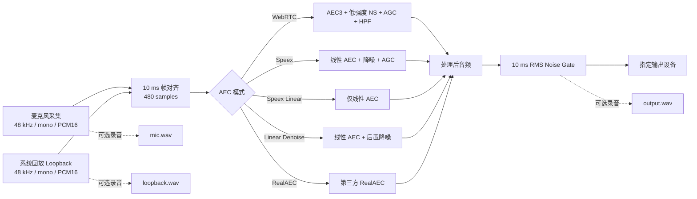

# 实时回声消除

[English](README.en.md)

一个面向 Windows 的实时声学回声消除（AEC）桌面程序。它通过 WASAPI 同时采集麦克风和系统回放流，使用可选算法处理 48 kHz、单声道、10 ms 音频帧，再将结果送到指定输出设备。程序提供 Qt 6 GUI、设备选择、实时波形、托盘控制、自启动、状态恢复和三轨分段录音。

> 当前面向 Windows x64 + MinGW。`RealAEC` 是随仓库提供的第三方二进制 SDK；其授权和再分发条件应由发布者单独确认。

## 功能

- 5 种处理模式：WebRTC AEC3、Speex、Speex 线性、Speex 线性 + 后置降噪、RealAEC
- 麦克风、系统回放和输出设备选择，配置自动保存
- 启动/停止引擎，托盘状态与平均单帧处理时间
- 麦克风、回放参考和处理结果三路实时波形
- 可选开机自启动、后台静默启动、上次引擎状态恢复
- 自定义背景图、透明度、自适应窗口比例和窗口尺寸记忆
- 三轨 PCM16 WAV 录音，每 10 分钟自动分段到程序目录下的 `record/`
- 单实例保护；重复启动时给出提示

## 声音处理流程



算法处理固定以 480 个采样为一帧：`480 / 48000 = 10 ms`。这里的“单帧处理耗时”只统计处理函数，不含设备缓存、线程调度、重采样和声卡链路延迟，因此不等于端到端延迟。

## 模式说明

| 配置值 | 处理链 | 特点 |
|---|---|---|
| `webrtc` | WebRTC AEC3 + 低强度噪声抑制 + 数字 AGC + 高通 | 回声抑制最强，可能改变音量和音色 |
| `speex` | Speex 线性 AEC + 预处理降噪 + AGC | 计算量低，完整 Speex 后处理链 |
| `speex_linear` | 仅 Speex 线性 AEC | 最少后处理，通常最自然，但残余回声/噪声较多 |
| `speex_linear_denoise` | Speex 线性 AEC + 后置降噪，关闭 AGC | 在原声保留和杂音抑制之间折中 |
| `real_aec` | 第三方 RealAEC SDK | 闭源二进制模式，兼容性取决于 SDK |

## 使用

从 GitHub Actions 构建产物或 Release 下载 ZIP，解压后运行 `SpeexEchoCanceller.exe`。首次启动选择三台设备和算法模式，然后启动引擎。关闭窗口时可选择退出或缩小到托盘；双击托盘图标恢复窗口。

程序配置保存在可执行文件同目录的 `config.ini`。录音开关开启后，每个分段包含三份单声道 PCM16 WAV，文件名带时间和轨道名。

### 配置参数

| 参数 | 类型/范围 | 说明 |
|---|---|---|
| `mic_id` | WASAPI 设备 ID | 麦克风输入设备 |
| `loopback_id` | WASAPI 设备 ID | 用于系统回放采集的渲染设备 |
| `output_id` | WASAPI 设备 ID | 处理结果播放设备 |
| `aec_type` | 上表五个值之一 | 当前处理模式 |
| `noise_gate_threshold_dbfs` | `-80.0`–`0.0` dBFS | 后置 Gate 的 10 ms 帧 RMS 阈值，GUI 步进为 0.1 dB |
| `auto_start` | `0` / `1` | 开机登录后静默启动程序 |
| `engine_running` | `0` / `1` | 记录退出前引擎状态，下次启动时恢复 |
| `recording_enabled` | `0` / `1` | 引擎运行时是否录制三轨音频 |
| `background_image` | 绝对或相对路径 | 背景图片；相对路径以 EXE 目录为基准 |
| `background_opacity` | `0.0`–`1.0` | 背景图可见强度 |
| `window_width` | 像素，`0` 表示自动 | 用户保存的窗口宽度 |
| `window_height` | 像素，`0` 表示自动 | 用户保存的窗口高度 |

示例：

```ini
aec_type=speex_linear_denoise
noise_gate_threshold_dbfs=-40.0
auto_start=1
engine_running=1
recording_enabled=0
background_image=D:\实时回声消除\background.jpg
background_opacity=0.5
window_width=640
window_height=926
```

GUI 程序还接受 `--background`，用于隐藏主窗口并从托盘启动。声音阈值滑条直接使用 `-80.0～0.0 dBFS`，步进为 0.1 dB。每个 10 ms 输出帧的 RMS 低于阈值时，整帧直接置零；修改阈值时，正在运行的引擎会自动重启以应用新值。旧版 `noise_gate_threshold` 归一化配置会在读取后自动换算并迁移。

## 构建

依赖：Windows 10/11 x64、CMake 3.20+、Qt 6.8.x MinGW 64-bit、对应的 MinGW 工具链。SpeexDSP、WebRTC APM、Abseil 和 RealAEC 文件位于 `third_party/` 或源码目录中；Qt SDK 可安装到 `third_party/qt6/`，该目录不会提交到 Git。

```powershell
cmake -S . -B build -G "MinGW Makefiles" `
  -DCMAKE_BUILD_TYPE=Release `
  -DCMAKE_PREFIX_PATH=C:/Qt/6.8.3/mingw_64 `
  -DAEC_ENABLE_LOCAL_DEPLOY=OFF
cmake --build build -j
powershell -File scripts/package_release.ps1 `
  -BuildDir build -OutputDir dist `
  -QtBinDir C:/Qt/6.8.3/mingw_64/bin
```

若要在本机每次构建后自动部署并在需要时恢复正在运行的实例：

```powershell
cmake -S . -B build -G "MinGW Makefiles" `
  -DCMAKE_BUILD_TYPE=Release `
  -DAEC_ENABLE_LOCAL_DEPLOY=ON `
  -DAEC_DEPLOY_DIR="D:/实时回声消除"
cmake --build build -j
```

`REAL_AEC_CONFIG` 可设为 `Debug` 或 `Release`，默认 `Debug`，这是当前实际运行验证过的 SDK 变体。

## 性能测算

测试日期为 2026-09-09，Windows x64、AMD64 Family 25（12 个逻辑处理器）、MinGW 13.1、Release 优化。样本为 48 kHz 单声道 PCM16，帧长 480 samples（10 ms）；每个开源模式处理 16,303 帧，Gate 阈值为 `-40 dBFS`。数字统计完整 `Process()` 调用，包含算法及其后的 RMS 计算和静音判断。GUI 显示的平均处理时长同样在 Gate 完成后停止计时。

| 模式 | 平均耗时/帧 | P95 | 最大值 | 实时因子 | 10 ms 预算占用 |
|---|---:|---:|---:|---:|---:|
| WebRTC | 0.1289 ms | 0.2643 ms | 11.5649 ms | 0.0129 | 1.29% |
| Speex | 0.1030 ms | 0.1898 ms | 1.2432 ms | 0.0103 | 1.03% |
| Speex Linear | 0.0696 ms | 0.1224 ms | 0.8816 ms | 0.0070 | 0.70% |
| Speex Linear Denoise | 0.1046 ms | 0.1885 ms | 2.0583 ms | 0.0105 | 1.05% |
| RealAEC | 未得到有效值 | — | — | — | — |

RealAEC 在独立基准进程调用 `REAL_AEC_create()` 时异常退出，尚未进入逐帧处理，因此不能把启动时间或猜测值填入表格。GUI 使用的 Debug SDK 模式仍保留；发布前应在目标机上单独完成稳定性和授权验证。

计算方式：

- 帧时长：`frame_ms = samples_per_frame / sample_rate × 1000`
- 平均耗时：`mean_ms = Σ process_time_ms / frame_count`
- P95：将单帧耗时升序排列后取 95% 分位
- 实时因子：`RTF = mean_process_ms / frame_ms`；小于 1 才能持续实时处理
- 预算占用：`RTF × 100%`

可复测：

```powershell
cmake -S . -B build-bench -G "MinGW Makefiles" `
  -DCMAKE_BUILD_TYPE=Release -DAEC_BUILD_BENCHMARK=ON `
  -DAEC_ENABLE_LOCAL_DEPLOY=OFF
cmake --build build-bench --target aec_benchmark -j
build-bench\aec_benchmark.exe mic.wav loopback.wav 7 speex_linear_denoise -40
```

## 回声消除效果

以下为同一段约 23 秒实际录音的离线代理指标。输入的麦克风与 loopback 最佳相关延迟为 1,921 samples（40.021 ms）。结果适合做同一样本的相对比较，不应当作标准实验室 ERLE；录音没有独立的“纯近端人声”真值，因此无法严格量化人声损失。

| 模式 | 输出 RMS | 相对麦克风电平 | 远端相关系数 | 投影回声电平 | 投影回声降低 |
|---|---:|---:|---:|---:|---:|
| WebRTC | -42.293 dBFS | -4.409 dB | 0.00099 | -102.354 dBFS | 56.471 dB |
| Speex | -32.469 dBFS | +5.415 dB | 0.00628 | -76.509 dBFS | 30.626 dB |
| Speex Linear | -42.721 dBFS | -4.837 dB | 0.01360 | -80.048 dBFS | 34.166 dB |
| Speex Linear Denoise | -43.856 dBFS | -5.972 dB | 0.00362 | -92.675 dBFS | 46.792 dB |
| RealAEC | -41.020 dBFS | -3.136 dB | 0.01015 | -80.891 dBFS | 35.008 dB |

在这段样本上，WebRTC 的远端泄漏代理最低；`speex_linear_denoise` 相比纯线性模式继续降低了相关残留，但总电平也更低。Speex 完整模式的 AGC 提升了总电平。总电平变化同时包含回声、噪声和人声，不能直接等同于“人声损失”。主观听感仍应使用双讲、单讲和静音片段分别验证。

指标定义：

- RMS dBFS：`20 log10(rms(x))`，PCM16 先归一化到 `[-1, 1]`
- 相对麦克风电平：`20 log10(rms(output) / rms(mic))`
- 远端相关系数：`|corr(output, loopback_aligned)|`，越小表示线性相关的远端残留越少
- 投影回声：先求 `a = (output·far)/(far·far)`，再计算 `rms(a×far)` 的 dBFS
- 投影回声降低：`projected_echo_mic_dBFS - projected_echo_output_dBFS`
- 标准 ERLE 通常写作 `10 log10(E[y²] / E[e²])`，其中 `y` 是回声路径输出、`e` 是消除后的残差；当前实录含近端人声和噪声，缺少独立 `y`，所以这里只报告投影代理值

复算指标需要 Python 3 和 NumPy：

```powershell
python scripts/analyze_aec.py --mic mic.wav --loopback loopback.wav `
  aec_webrtc.wav aec_speex.wav aec_speex_linear.wav `
  aec_speex_linear_denoise.wav aec_real_aec.wav
```

## 自动构建与发版

`.github/workflows/build-and-release.yml` 会在 push 和 pull request 时构建并上传 Windows ZIP；推送 `v*` 标签时，还会自动创建对应 GitHub Release 并附加 ZIP。示例：

```powershell
git tag v1.0.0
git push origin v1.0.0
```

## 目录

```text
assets/                     托盘与窗口图标资源
include/                    公共/平台头文件
libspeex/, libspeexdsp/     Speex 源码
third_party/                WebRTC APM、Abseil、RealAEC 等依赖
scripts/                    部署、打包和音频分析脚本
qt_gui_main.cpp             Qt GUI 与录音实现
main.cpp                    音频算法、配置和 WASAPI 引擎
benchmark_main.cpp          单帧性能基准程序
```
